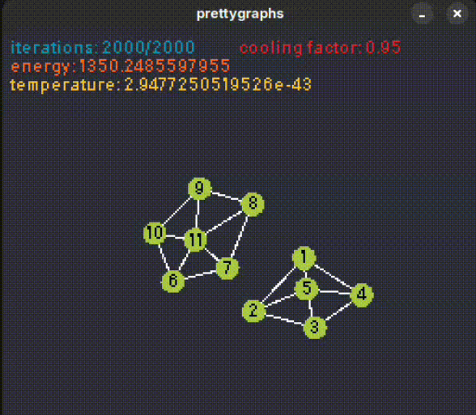

# prettygraphs

This is a Love2d implementation of the simulated annealing algorithm. For more information please check out my [blog](https://riprtx.netlify.app/blogs/simulated_annealing_love2d/), where I explain how the project is structured and the way it works.

